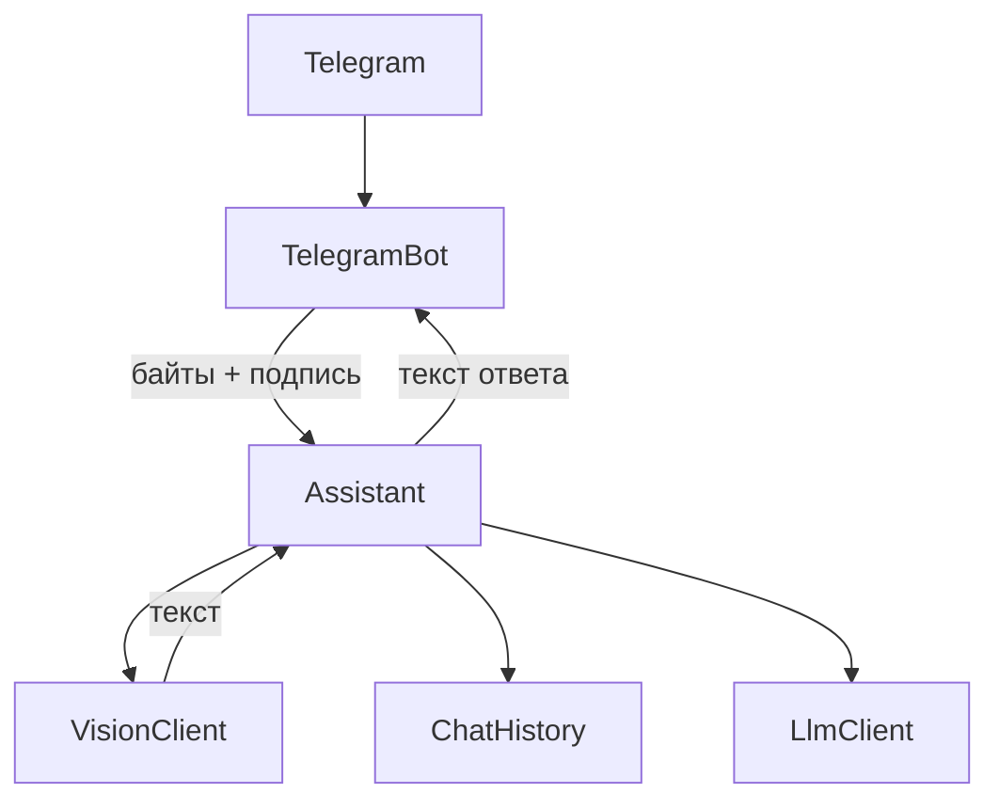

# Итерация 11: обработка фото

Цепочка по [docs/vision.md](docs/vision.md) и [docs/adr/0013-openrouter-vision-base64.md](docs/adr/0013-openrouter-vision-base64.md):



Хендлер не ходит к LLM. Байты и base64 не пишутся в историю и в лог. Стикеры, документы, видео — без ответа, как сейчас.

Аудио, новые команды, retry, `VISION_BASE_URL` — вне итерации. `docs/tasklist.md` не трогаем, пока пользователь не подтвердит, что бот проверен.

После подтверждения плана — реализация, без коммита. Коммит — отдельный шаг после проверки бота.

---

## Файлы

**Новый**
- [src/assistant/vision_client.py](src/assistant/vision_client.py) — класс `VisionClient`

**Меняем**
- [src/assistant/config.py](src/assistant/config.py)
- [src/assistant/assistant.py](src/assistant/assistant.py)
- [src/assistant/telegram_bot.py](src/assistant/telegram_bot.py)
- [src/assistant/__main__.py](src/assistant/__main__.py)
- [.env.example](.env.example)
- [README.md](README.md)

**Не трогаем**
- `llm_client.py`, `chat_history.py` — текст как сейчас; `Assistant.respond_photo` после разбора вызывает существующий `respond`
- `docs/vision.md`, `docs/idea.md`, ADR — фото уже описаны
- `.env` — секреты; после кода нужно вручную добавить `VISION_MODEL` и `VISION_PROMPT`, иначе бот не стартует

---

## 1. Config и `.env.example`

В `Config.__init__` обязательные поля через `_require`:

- `self.vision_model` ← `VISION_MODEL`
- `self.vision_prompt` ← `VISION_PROMPT`

Ключ тот же `LLM_API_KEY`. Отдельный URL для фото не вводим: VisionClient всегда бьёт в `https://openrouter.ai/api/v1` (текст по-прежнему может идти в Ollama).

В [.env.example](.env.example) — две переменные рядом с текстовыми. `VISION_MODEL` пустой, как `LLM_MODEL`. `VISION_PROMPT` — готовый текст, в духе: описать снимок для занятия (текст, формула, схема, задача) и кратко сказать, что делать дальше; если есть подпись пользователя — учесть как просьбу.

---

## 2. `VisionClient` — новый файл

Один класс, один метод. Свой `AsyncOpenAI`, не `config.base_url`:

```python
class VisionClient:
    def __init__(self, config: Config):
        self._client = AsyncOpenAI(
            api_key=config.llm_api_key or "ollama",
            base_url="https://openrouter.ai/api/v1",
        )
        self._model = config.vision_model
        self._prompt = config.vision_prompt

    async def describe(self, image: bytes, caption: str | None = None) -> str:
        ...
```

Запрос: `chat.completions.create`, одно user-сообщение, `content` — массив из двух частей, **сначала текст, потом картинка** (рекомендация OpenRouter):

1. `{"type": "text", "text": ...}` — `VISION_PROMPT`; если есть подпись, дописываем её в тот же текст
2. `{"type": "image_url", "image_url": {"url": "data:image/jpeg;base64,..."}}`

MIME `image/jpeg` — сжатые фото Telegram. `max_tokens` и прочий сэмплинг не выносим. Возврат — `choices[0].message.content`. Исключения наружу, ловит `Assistant`.

---

## 3. `Assistant`

В конструктор — `vision_client: VisionClient`. Новый метод:

```python
async def respond_photo(self, chat_id: int, image: bytes, caption: str | None) -> str:
```

1. `await self._vision.describe(image, caption)`
2. Успех: лог `Vision chat_id=... text=...` (текст разбора, без байтов)
3. Собрать реплику пользователя: текст vision; если была подпись — подпись + разбор (видение: в историю попадает текст vision **плюс** подпись)
4. `return await self.respond(chat_id, user_text)` — запись в историю и вызов преподавателя как у текста

Ошибка vision: `log.error(..., exc_info=True)`, история не меняется, та же фраза `_ERROR_MESSAGE`. Ошибка LLM уже снимает последнюю user-реплику внутри `respond`.

---

## 4. `TelegramBot`

Регистрация **после** команд, фильтр `F.photo` (не `F.document`, не стикер):

```python
self._dp.message.register(self._on_photo, F.photo)
```

`_on_photo`:
1. Лог: `chat_id` и `type=photo`, без байтов и base64
2. Файл: `message.photo[-1]` (наибольший размер)
3. Скачать через `await self._bot.download(...)` в `BytesIO`, взять байты
4. `await self._assistant.respond_photo(chat_id, image, message.caption)`
5. Лог ответа и `message.answer`

Альбомы не склеиваем: каждое фото — отдельное сообщение Telegram. Картинка как документ — прочий нетекст, без ответа.

`/start`: к приветствию одна фраза, что можно прислать фото по теме (конспект, задача, схема). Про голос не пишем — это итерация 12.

---

## 5. `__main__.py`

- Собрать `VisionClient(config)`, передать в `Assistant`
- Лог старта: `provider`, текстовая модель и `vision_model` (без ключей)

---

## 6. README

- В «Возможности» — пункт: можно прислать фото, бот разберёт снимок и продолжит занятие
- В стек — строка «Фото: OpenRouter, vision-модель»
- В пример `.env` — `VISION_MODEL` и `VISION_PROMPT`

Большую mermaid-схему README не перерисовываем: источник архитектуры — vision.md. Итерация просит только явно сказать, что фото можно прислать.

---

## Проверка (пользователь)

1. В `.env` добавить `VISION_MODEL` (vision-модель OpenRouter) и `VISION_PROMPT`
2. `make build` / `make run` (или перезапуск Railway с теми же переменными)
3. `/start` упоминает фото
4. Текст по-прежнему отвечает
5. Фото без подписи — разбор и ответ преподавателя
6. Фото с подписью («проверь решение») — подпись учитывается
7. Стикер — молчание
8. В логе: старт с vision-моделью; входящее фото без байтов; текст после разбора; ответ. При сбое OpenRouter — фраза об ошибке, в логе traceback
