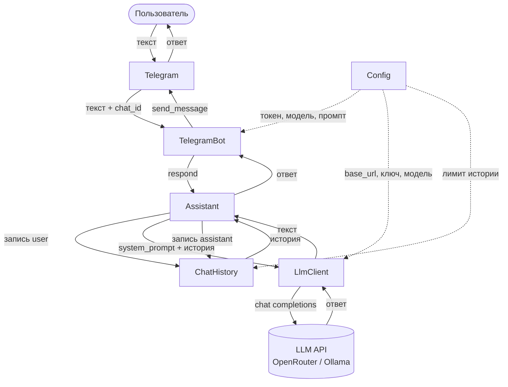

# LLMSTART-AIDD — Telegram-бот «Онлайн-преподаватель»

Telegram-бот на базе LLM, настроенный на роль онлайн-преподавателя. Объясняет темы простым языком с примерами, отвечает на уточняющие вопросы и проверяет усвоение материала.

## Возможности

- **Объяснение тем** — напишите тему, и бот развёрнуто объяснит её с примерами
- **Уточняющие вопросы** — задавайте вопросы по объяснённому материалу
- **Проверка знаний** — после объяснения бот задаёт 1–2 вопроса для закрепления
- **Контекст диалога** — бот помнит историю разговора в рамках сессии
- **Настраиваемая роль** — роль задаётся через `SYSTEM_PROMPT` в `.env` без изменения кода

## Технологический стек

| Слой | Выбор |
|---|---|
| Язык | Python 3.12+ |
| Зависимости | `uv`, `pyproject.toml` |
| Telegram | aiogram 3, long polling |
| LLM | клиент `openai` (OpenAI-совместимый API) |
| Провайдеры LLM | OpenRouter, Ollama |
| Контейнеризация | Docker, Docker Compose |
| Облако | Railway |
| Конфиг | переменные окружения, `.env` |

## Архитектура

Один процесс, объекты собираются вручную в `__main__.py`. Поток сообщения:



## Быстрый старт (локально)

### Требования

- Docker и Docker Compose
- Токен Telegram-бота ([получить у @BotFather](https://t.me/BotFather))
- API-ключ OpenRouter (или локальная Ollama)

### Установка

```bash
git clone <repo-url>
cd llmstart-aidd
cp .env.example .env
```

Заполните `.env`:

```env
TELEGRAM_BOT_TOKEN=your_token
LLM_PROVIDER=openrouter
LLM_MODEL=openai/gpt-4o-mini
LLM_API_KEY=your_openrouter_key
SYSTEM_PROMPT=Ты — онлайн-преподаватель...
```

### Запуск

```bash
make build   # собрать образ
make run     # запустить на переднем плане (Ctrl+C для остановки)
make up      # запустить в фоне
make logs    # смотреть логи
make down    # остановить
```

## Деплой в Railway

1. Подключите репозиторий на [railway.app](https://railway.app/new)
2. В разделе **Variables** задайте те же переменные, что и в `.env`
3. Railway автоматически соберёт Docker-образ и запустит бота

Long polling работает в облаке без изменений — публичный URL не нужен.

## Демонстрация

<!-- Добавьте скриншот или GIF с работой бота -->

> _Скриншот или GIF появится здесь_
