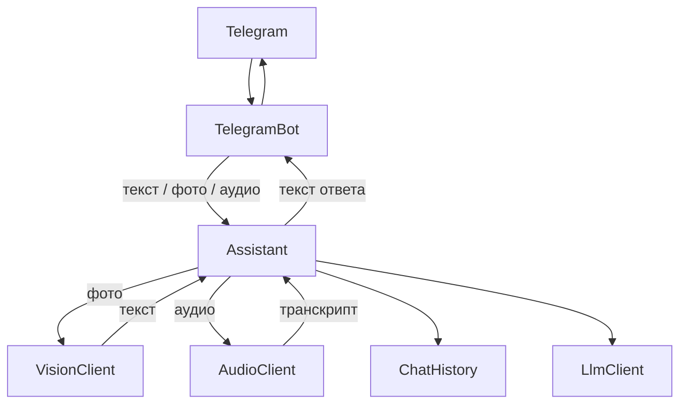

# Техническое видение

Документ — исходная точка разработки. Цель: ИИ-преподаватель в Telegram (текст, фото, голос) с ролью, заданной системным промптом, запущенный в облаке Railway.

Вне проекта: база данных, webhook, очереди, RAG, фреймворки агентов, стриминг.

Связанные решения: [ADR](adr/).

## Технологии

| Слой | Выбор |
|---|---|
| Язык | Python 3.12+ |
| Зависимости | `uv`, манифест `pyproject.toml` |
| Сборка и команды | `make` (обёртка над Docker Compose); в образе зависимости ставит `uv` |
| Запуск | Docker Compose локально |
| Telegram | aiogram 3, long polling |
| LLM (текст) | официальный клиент `openai` |
| Провайдеры LLM | OpenRouter и локальная Ollama (оба — OpenAI-совместимый API) |
| Фото | OpenRouter, vision-модель, изображение → текст |
| Аудио | OpenRouter STT (`/audio/transcriptions`), `input_audio`, формат как в Telegram (`ogg`) |
| Конфиг | переменные окружения, файл `.env` |
| Логи | стандартный модуль `logging` |
| История диалога | память процесса, без БД |

Переключение текстового провайдера — переменная `LLM_PROVIDER` в `.env` (`openrouter` или `ollama`). URL по умолчанию выбирает `Config`. Ключ и имя модели — отдельные переменные. Код вызова текстового LLM один: клиент `openai`.

Фото и аудио по умолчанию идут в OpenRouter, независимо от `LLM_PROVIDER`. Модели и промпты — отдельные переменные.

Команды `make` — тонкие обёртки над `docker compose`. Зависимости в образе ставит `uv` по `pyproject.toml` и `uv.lock`.

## Принцип разработки

1. **KISS.** Новый класс, файл или зависимость — только если без них бот не работает или код становится запутаннее.
2. **OOP.** Поведение — в классах. Модули с набором свободных функций не плодим.
3. **Один класс — один файл.** Имя файла = имя класса в snake_case (`llm_client.py` → `LlmClient`).
4. **Корень кода:** `src/assistant/`. Плоская структура пакета, без слоёв `core` / `infrastructure` / `domain`.
5. **Тонкий слой Telegram.** Хендлер принимает сообщение (текст, фото или аудио), при необходимости скачивает файл и отдаёт текст ответа. Диалог, разбор фото, транскрипция и вызов LLM — не в хендлере.
6. **Без абстракций «на вырост».** Текстовый LLM — конфиг одного клиента `openai`. Фото и аудио — отдельные клиенты с одним методом; реализация по умолчанию — OpenRouter. Другую реализацию подставляют в `__main__.py`. Нет DI-контейнера, ABC и фабрик.
7. **async** только там, где его требуют aiogram и клиент OpenAI.
8. **Секреты и параметры запуска** — только в `.env` (и переменных окружения). В код не вшиваем ключи, URL, имена моделей, токен бота.

## Структура проекта

```
Makefile
Dockerfile
docker-compose.yml
pyproject.toml
uv.lock
.env.example
docs/
src/assistant/
  __init__.py
  __main__.py
  config.py
  llm_client.py
  vision_client.py
  audio_client.py
  chat_history.py
  assistant.py
  telegram_bot.py
```

| Файл | Класс | Роль |
|---|---|---|
| `config.py` | `Config` | читает окружение |
| `llm_client.py` | `LlmClient` | вызов chat completions (текст) |
| `vision_client.py` | `VisionClient` | изображение → текст; по умолчанию OpenRouter |
| `audio_client.py` | `AudioClient` | аудио → транскрипт; по умолчанию OpenRouter STT, `input_audio` |
| `chat_history.py` | `ChatHistory` | история в памяти по `chat_id`; метод `clear(chat_id)` сбрасывает диалог |
| `assistant.py` | `Assistant` | оркестрация: фото/аудио → текст, затем системный промпт + история + LLM → ответ |
| `telegram_bot.py` | `TelegramBot` | polling и хендлеры, вызывает `Assistant` |

Исключения из «один класс — один файл»: `__init__.py`, `__main__.py`. Точка входа собирает объекты и запускает бота. Хендлеры живут в `TelegramBot`, отдельный класс хендлеров не заводим.

`.env` в репозиторий не коммитим. В git — `.env.example`. Compose передаёт `.env` в контейнер.

## Архитектура

Один процесс. Объекты собираются вручную в `__main__.py`, контейнера DI нет.

Поток сообщения:



- `TelegramBot` использует `Assistant`. Скачивает файл фото или аудио и передаёт байты; к LLM не ходит.
- `Assistant` использует `ChatHistory`, `LlmClient`, `VisionClient`, `AudioClient`.
- `VisionClient`: байты изображения (+ подпись) → текст.
- `AudioClient`: байты аудио + формат → транскрипт.
- `LlmClient`: список текстовых сообщений → ответ преподавателя.
- Клиенты — точки расширения: в `__main__.py` можно подставить другую реализацию с тем же методом. По умолчанию фото и аудио — OpenRouter.
- `Config` отдаёт токен бота, провайдера текстового LLM (`LLM_PROVIDER`), URL, ключ, модели и промпты, лимит токенов ответа.

Системный промпт преподавателя — переменная `SYSTEM_PROMPT` в `.env`. Ответ в Telegram — целиком, без стриминга. Ошибка LLM, vision, аудио или сети: запись в лог и короткое сообщение пользователю. Ретраев и очередей нет.

## Модель данных

БД и ORM нет. Состояние только в памяти процесса.

**История** — словарь: ключ `chat_id` (int из Telegram), значение — список реплик.

**Реплика** — словарь в формате OpenAI: `role` (`user` | `assistant`) и `content` (str). Класс `Message` не заводим. Байты фото и аудио в историю не пишем: в `content` попадает текст от `VisionClient` или транскрипт от `AudioClient` (плюс подпись к фото, если была).

Системный промпт в истории не хранится. `Assistant` каждый раз ставит его первым сообщением при вызове LLM.

**Лимит:** `MAX_HISTORY_MESSAGES` в `.env`, по умолчанию 20 реплик на чат. При превышении `ChatHistory` удаляет самые старые реплики.

Других сущностей (пользователь, сессия, учёт токенов) нет.

## Работа с LLM

`LlmClient` держит один `openai.AsyncOpenAI`. Метод один: список сообщений → текст ответа. Стриминга нет. В этот клиент идут только текст и история; изображения и аудио сюда не передаём.

`Config` выбирает `base_url` текстового LLM:

| `LLM_PROVIDER` | `base_url` по умолчанию |
|---|---|
| `openrouter` | `https://openrouter.ai/api/v1` |
| `ollama` | `http://localhost:11434/v1` |

Если задан `LLM_BASE_URL` — используется он, таблица не применяется. Ещё из `.env`: `LLM_API_KEY`, `LLM_MODEL`. Для Ollama пустой ключ заменяется на заглушку `ollama`. Неизвестное `LLM_PROVIDER` — ошибка при старте, бот не запускается.

В контейнере `localhost` — сам контейнер, не машина. Для Ollama на хосте задайте `LLM_BASE_URL` (например `http://host.docker.internal:11434/v1`).

`Assistant` собирает запрос преподавателю: первым идёт `system` из `SYSTEM_PROMPT`, затем история чата. В вызов LLM передаётся `max_tokens` из `LLM_MAX_TOKENS` (по умолчанию 2000). Другие параметры сэмплинга в конфиг не выносим.

Retry-библиотек и обёрток нет.

## Фото и аудио

Фото и аудио сначала превращаются в текст, затем идут в тот же цикл преподавателя, что и обычное сообщение.

**Фото.** `VisionClient` по умолчанию вызывает OpenRouter chat completions с vision-моделью: текст промпта (`VISION_PROMPT`) и изображение (base64). На выходе — текст: что на фото и что с ним делать в занятии. Подпись к фото, если есть, передаётся вместе с изображением: пользователь может попросить объяснить снимок.

**Аудио.** `AudioClient` по умолчанию вызывает OpenRouter `POST /api/v1/audio/transcriptions`: raw base64 и `format` файла (для голосовых Telegram — `ogg`). Модель — `AUDIO_MODEL` (например Whisper). Без конвертации в WAV и без `ffmpeg`. На выходе — текст реплики пользователя.

URL по умолчанию — `https://openrouter.ai/api/v1`, ключ — `LLM_API_KEY`. Если текстовый провайдер — Ollama, ключ OpenRouter всё равно нужен: им пользуются клиенты фото и аудио.

Модели (`VISION_MODEL`, `AUDIO_MODEL`) и промпты не делят с текстовым преподавателем.

## Сценарии работы

**Запуск.** Процесс читает `.env`, проверяет обязательные переменные, стартует long polling. Невалидный `LLM_PROVIDER` или пустой токен Telegram — выход с ошибкой в логе.

**`/start`.** Приветствие от преподавателя с предложением выбрать тему. Можно писать, прислать фото или голос. История чата не меняется.

**Текст.** Сообщение пользователя → `Assistant` → один ответ модели. Поведение определяется ролью в `SYSTEM_PROMPT`.

**Фото.** Снимок по выбранной теме (конспект, задача, схема, страница учебника, скрин и любой другой). `TelegramBot` скачивает файл → `Assistant` → `VisionClient` → текст в историю → `LlmClient` → ответ преподавателя.

**Аудио.** Голосовое или аудиосообщение. `TelegramBot` скачивает файл → `Assistant` → `AudioClient` → транскрипт в историю → `LlmClient` → ответ преподавателя.

**Роль «ИИ-преподаватель».** `SYSTEM_PROMPT` задаёт наставника, который ведёт полный цикл обучения:

1. Определяет уровень и цель.
2. Составляет программу.
3. Объясняет тему простым языком.
4. Задаёт вопросы и практические задания.
5. Проверяет ответы.
6. Адаптирует сложность.
7. Отслеживает прогресс в рамках истории диалога.

Пример `SYSTEM_PROMPT` фиксируется в `.env.example`. Смена предмета или стиля — правка `SYSTEM_PROMPT` и перезапуск, код не меняется. Промпты фото и аудио — отдельные переменные.

**`/clear_chat`.** История текущего чата очищается. Бот подтверждает сбросом: «История диалога очищена. Можете начать новую тему.» Вызов LLM не производится.

**Прочий нетекст** (стикер, видео и т.п.) — без ответа и без вызова LLM.

**Ошибка LLM, vision, аудио или сети.** Пользователю фиксированная фраза: не удалось получить ответ, попробуйте ещё раз. В лог — исключение. Реплика пользователя в историю не пишется, если модель не ответила.

Рестарт процесса тоже очищает память.

## Конфигурирование

`Config` при создании вызывает `load_dotenv()` и читает окружение. Нет обязательного значения — исключение, процесс не стартует. Файлов YAML/TOML для приложения нет.

| Переменная | Обязательна | Смысл |
|---|---|---|
| `TELEGRAM_BOT_TOKEN` | да | токен бота |
| `LLM_PROVIDER` | да | `openrouter` или `ollama` |
| `LLM_MODEL` | да | имя текстовой модели у провайдера |
| `SYSTEM_PROMPT` | да | роль преподавателя |
| `VISION_MODEL` | да | vision-модель OpenRouter |
| `VISION_PROMPT` | да | промпт разбора фото |
| `AUDIO_MODEL` | да | STT-модель OpenRouter (например Whisper) |
| `AUDIO_PROMPT` | да | зарезервировано; в STT-запрос не передаётся |
| `LLM_API_KEY` | для OpenRouter — да; для Ollama как текста — да, если нужны фото и аудио | ключ API (текстовый OpenRouter и клиенты фото/аудио) |
| `LLM_BASE_URL` | нет | перекрывает URL текстового провайдера |
| `LLM_MAX_TOKENS` | нет | лимит токенов ответа модели, по умолчанию `2000` |
| `MAX_HISTORY_MESSAGES` | нет | по умолчанию `20` |
| `LOG_LEVEL` | нет | по умолчанию `INFO` |
| `PORT` | нет | inject-ится Railway, ботом не используется |

В git: `.env.example`. Файл `.env` в `.gitignore`. Смена текстового провайдера: `LLM_PROVIDER` (плюс ключ и модель), перезапуск. Смена модели или промпта фото/аудио — те же переменные, код не меняется.

## Логирование

Стандартный модуль `logging`. Один обработчик — stdout. Формат: время, уровень, логгер, сообщение. Файлов, ротации, JSON, внешних сервисов нет.

Уровень — `LOG_LEVEL`, по умолчанию `INFO`. Настройка один раз при старте в `__main__.py`.

В лог:

- старт: текстовый провайдер и модели текста, фото, аудио (без ключей и токена)
- входящее текстовое сообщение: `chat_id` и текст
- входящее фото или аудио: `chat_id` и тип (байты и base64 не пишем)
- текст после разбора фото или транскрипции: `chat_id` и текст
- ответ модели: `chat_id` и текст
- ошибка LLM / vision / аудио / сети: исключение (`exc_info`)
- невалидный конфиг: ошибка и выход

Секреты из `.env` в лог не пишем.

## Сборка и деплой

Бот запускается локально в Docker и в облаке Railway. CI и systemd в проект не входят.

В корне: `Dockerfile`, `docker-compose.yml`, `railway.toml`, `pyproject.toml` (пакет, зависимости, Python ≥ 3.12), `uv.lock` в git, `Makefile` как тонкая обёртка над `docker compose`. В образе зависимости ставит `uv`. Compose читает `.env` и передаёт его в контейнер.

| Цель | Действие |
|---|---|
| `make build` | `docker compose build` |
| `make run` | `docker compose up` (передний план) |
| `make up` | `docker compose up -d` (фон) |
| `make down` | `docker compose down` |
| `make logs` | `docker compose logs -f` |

**Локальный запуск.** Clone, заполнить `.env`, `make build`, `make run` или `make up`. Публичный URL не нужен: long polling сам ходит к Telegram.

**Передний план:** `make run`, остановка Ctrl+C.

**Фон:** `make up`. Логи — stdout контейнера, смотреть через `make logs`. Остановка: `make down`. `nohup` и `screen` не используем.

Рестарт контейнера очищает историю диалогов: она живёт только в памяти процесса.

### Railway

Railway разворачивает бот в облаке, используя существующий `Dockerfile`.

`railway.toml` в корне проекта:

```toml
[build]
builder = "dockerfile"

[deploy]
startCommand = "python -m assistant"
restartPolicyType = "on_failure"
```

Переменные окружения задаются в дашборде Railway — те же, что в `.env` (кроме `PORT`: Railway inject-ит её сам, но бот её не использует). Long polling работает в облаке без изменений — публичный URL не нужен.

Деплой: подключить репозиторий GitHub в Railway, задать переменные, Railway соберёт образ и запустит контейнер. Альтернатива: `railway up` из CLI.
